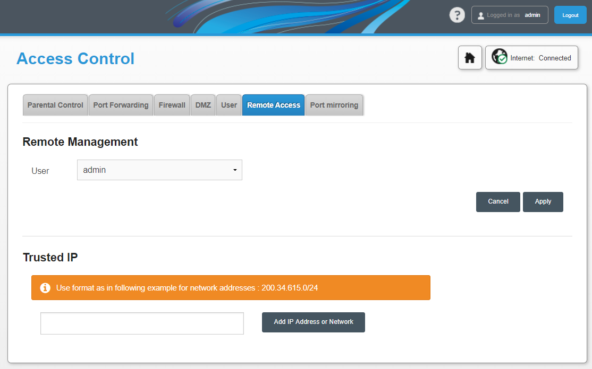

# Obteniendo la *PLOAM password* de un router F@ST 5657 <!-- omit in toc -->

Lo que te voy a contar **no es una vulnerabilidad**, ni tampoco un fallo de seguridad del operador. Las acciones descritas sólo afectan a tu propio router.

Sin embargo, es un modo de acercarse a un problema y trazar un plan con las opciones disponibles para obtener el resultado deseado. Resultado que -es cierto- se aparta del diseño original del sistema.

Es, dicho de otra manera, un relato sobre **hacking**.

- [Redes de fibra](#redes-de-fibra)
- [Aproximaciones fallidas](#aproximaciones-fallidas)
- [El CWMP, más conocido por TR-069](#el-cwmp-más-conocido-por-tr-069)
- [Ganar admin](#ganar-admin)
- [MitM al CWMP TR-069](#mitm-al-cwmp-tr-069)
- [Habilitar administración por SSH](#habilitar-administración-por-ssh)

## Redes de fibra

La semana pasada me instalaron "la fibra".

Han pasado diez años desde el comienzo en Telefónica de un proyecto llamado FTTH (Fiber To The Home). Consistía en sustituir por fibra óptica el par trenzado de la *última milla*. Sonaba a ciencia ficción por entonces. La fibra estaba reservada a los troncales y redes de enlace especiales. Lo más próximo era ONO, y el bucle de abonado seguía haciéndolo en coaxial.

Al grano, no conozco las redes de fibra. Nunca he trabajando con ellas. Pero parece ser que, a diferencia de las redes de ADSL, se necesita una contraseña de acceso para establecer la comunicación con la central. Esa contraseña he visto que la llaman **clave GPON**, pero mi router la llama *PLOAM Password* y así voy a llamarla yo.


Lo **primero** que hace el instalador tras encender el router es introducir la contraseña. A propósito, si le preguntas por ella amablemente quizá te la revele, pero no tiene ninguna obligación de ello. De hecho con toda seguridad le han ordenado que no lo haga.

Esa contraseña la necesitarás si piensas sustituir el router del operador por uno tuyo. Pero también si se te estropea el actual o sufre algún problema. Sin contraseña no hay conexión, y sin conexión no hay administración remota. Podrían dártela por teléfono pero quizá el operador no sepa cómo obtenerla. Solo queda enviar un técnico **a domicilio** a reparar la avería.

Quedémonos con que hay un dato desconocido, y vamos a intentar obtenerlo.

## Aproximaciones fallidas

Antes de nada buscamos en internet si alguien lo ha hecho antes, por supuesto. Algunas versiones anteriores del firmware tenían descuidos evidentes.

El modelo 5655v2, según parece, tenía la [password en la interfaz web][1]. Es un fallo común fruto de las prisas o inexperiencia con el framework. **Inaceptable**.

Un firmware más reciente del mismo modelo corrige ese fallo y ya no puede obtenerse la contraseña desde la interfaz web. Debe hacerse entrando con una **shell** al dispositivo y leyendo el fichero de configuración. Viene deshabilitada, no obstante, pero puede habilitarse mediante [opciones indocumentadas][2] en la web.

En mi modelo, el F@ST 5657, tampoco funciona ya este último método. Habrá que echarle imaginación.

Miramos los **puertos abiertos**. Quién sabe, tal vez la administración por telnet o por SSH está activada de serie. Si bien sería extraño que esté activada pero en la web no aparezcan opciones para desactivarla.

    $ nmap 192.168.1.1 -sV

    Starting Nmap 7.60 ( https://nmap.org ) at 2020-10-24 21:03 CEST
    Nmap scan report for home (192.168.1.1)
    Host is up (0.0035s latency).
    Not shown: 845 closed ports, 148 filtered ports
    PORT      STATE SERVICE     VERSION
    53/tcp    open  domain      dnsmasq 2.78
    80/tcp    open  http        lighttpd
    139/tcp   open  netbios-ssn Samba smbd 3.X - 4.X (workgroup: HOME)
    443/tcp   open  ssl/http    lighttpd
    445/tcp   open  netbios-ssn Samba smbd 3.X - 4.X (workgroup: HOME)
    5060/tcp  open  sip?
    49153/tcp open  upnp        Portable SDK for UPnP devices 1.6.18 (Linux 4.1.51-5.02L.05; UPnP 1.0)
    Service Info: OS: Linux; CPE: cpe:/o:linux:linux_kernel:4.1.51-5.02l.05

El **DNS** (53), la **web** de administración (80), la web por https (443), compartir ficheros (139 y 445), el **teléfono** (5060) y el **uPnP** (49153). Quizá alguno de los servicios tenga exploits conocidos. De momento nada de telnet. Vamos a seguir mirando.

**Descarga de la configuración**. Probemos lo más fácil. Hago un backup de la configuración por si puedo ver la contraseña ahí directamente. O si no podría manipular el backup para activar el telnet o el SSH cuando lo cargue.


No es texto, es un fichero binario. Quizá comprimido, cifrado o las dos cosas. AEAD me recuerda a *authenticated encryption with associated data*, prefiero buscar otro camino.

Si no puedo obtener una shell por red, tal vez tenga que utilizar una conexión serie. Pero implicaría desmontar un router nuevo y manipular el hardware. Podría salir mal.


## El CWMP, más conocido por TR-069

CWMP son las siglas de *CPE WAN Management Protocol* y CPE, a su vez, las de *Customer Premises Equipment*. En español también se le llama EDC, **Equipo en Domicilio del Cliente**.

Son equipos propiedad de la compañía suministradora pero que están en tu casa. Como *tu router*. Esta advertencia es importante: por regla general, el router es de la compañía, no tuyo. Te lo cede como el contador de telegestión de la luz o del gas. Manipular *tu router* sin autorización puede tener consecuencias, por ejemplo que el operador no se haga cargo si sufres una avería y te cobre por la revisión.

Ahora pongámonos un instante en la piel de un técnico de soporte. Cuando tienes una red con decenas de miles equipos deslocalizados en casa del cliente te interesa tenerlos lo más controlados posible, configurarlos **desde un punto centralizado** y recibir información periódica sobre su estado y la conexión. Marca, modelo, número de serie, versión del firmware, atenuación, parámetros de sincronización y hasta la temperatura.

Hay un cacharro llamado **ACS** (*Auto Configuration Server*) al que se conecta el router nada más enchufarlo a la fibra o el ADSL. Este le proporciona los parámetros necesarios. Entre otras cosas, le cambia la **contraseña** de administrador y al cliente le deja un usuario más o menos restringido. ¿Te suena?

En parte para que el sobrino del cliente no toque donde no sabe, se quede sin conexión y te llame a ti culpándote de ello.

Tras esta primera vez, el CPE se conecta al ACS periódicamente para informar de algunos parámetros. Eso se llama *Technical Report* (TR), de ahi TR-069.

El ACS sirve también para hacer **diagnóstico** remoto de las incidencias. Si un cliente te llama diciendo que no tiene internet, puedes confirmarlo rápidamente mirando en el sistema su último estado: qué router tiene, hace cuanto que se lo pusieron, si está on-line o cuándo fue su último informe periódico.

Por si fuera poco, tienes la posibilidad de **enviar comandos** para reiniciárselo remotamente, subir y bajar ficheros, actualizar el firmware, o conectarte al equipo para abrirle puertos o lo que necesite.

¿Verdad que suena bien?

## Ganar admin

Dado que las opciones del TR-069 no aparecen entrando con el usuario 1234, ni se pueden ver llamando al backend de la web directamente, para continuar la historia necesitamos entrar como administrador.


La forma más fácil para ganar admin en tu propio router es **reiniciarlo** a valores de fábrica. La *PLOAM Password* se debería conservar en un espacio protegido. Sin embargo, existe la posibilidad de que se borre. Te quedarías sin Internet y toca llamar. Tenlo en cuenta.

Este router se reinicia presionando el botón de reset durante unos 20 segundos. El procedimiento está descrito en tutoriales para modelos similares.

Una vez reiniciado y, por supuesto, desconectado de la red ya podemos entrar como *admin* y ver las opciones del cliente TR-069.


La URL del ACS y el usuario se ven a simple vista. La contraseña de acceso al ACS no la necesitamos ahora mismo. Y la PLOAM Password no te la va a mostrar ni siquiera como admin.

En esa pantalla, aprovechamos para **desactivar** el cliente. Así no se cambiará la contraseña. Haremos también un backup de la configuración. Así cuando queramos recuperar el usuario administrador más adelante ya no necesitamos reiniciar a valores de fábrica, será suficiente cargar esta configuración.

## MitM al CWMP TR-069

¿Te has fijado en la URL del ACS? Es HTTPS. O sea una web. ¿Y si nos conectamos qué tiene?


Pero aún teniendo el usuario y contraseña no conocemos el protocolo. Puedes mirar [la especificación][3], es pública. Vas a ver que es **SOAP** y varios comandos, pero no vas a sacar nada en claro.

Lo que sí resultaría útil es escuchar la comunicación entre el router y el ACS. ¿Pero cómo hacemos eso?

¿Con **Wireshark**? No, la comunicación sale por la interfaz de fibra, no la vas a ver. Además es HTTPs, irá cifrada.

¿Con **Burpsuite**? No, el router no nos deja configurar un proxy.

¿Con **Burpsuite** en modo proxy **transparente**? No, el DNS y la tabla de rutas se lo proporciona el operador y no podemos cambiarlo. Un ARP spoofing o rogue DHCP no van a colar.

Si pudiera cambiar la URL para apuntar a un servidor ACS mío, tal vez pudiera extraer información útil.

Cambio la URL a la IP de un servidor local, donde he dejado escuchando un netcat.


Y activo el cliente. A ver si llega la petición...

    pi@raspberrypi:~$ netcat -lvp 10302
    Listening on [0.0.0.0] (family 0, port 10302)
    Connection from [192.168.1.1] port 10302 [tcp/*] accepted (family 2, sport 53720)
    POST /OLT********/11/ HTTP/1.1
    Host: 192.168.1.121:10302
    User-Agent: gSOAP/2.7
    Content-Type: text/xml; charset=utf-8
    Content-Length: 2280
    Connection: keep-alive
    SOAPAction:

    <?xml version="1.0" encoding="UTF-8"?>
    <SOAP-ENV:Envelope xmlns:SOAP-ENV="http://schemas.xmlsoap.org/soap/envelope/" xmlns:SOAP-ENC="http://schemas.xmlsoap.org/soap/encoding/" xmlns:xsi="http://www.w3.org/2001/XMLSchema-instance" xmlns:xsd="http://www.w3.org/2001/XMLSchema" xmlns:cwmp="urn:dslforum-org:cwmp-1-0">
    ...

¡Sí! ¿Y ahora, cómo sé qué responder?

Hay un ACS opensource: [Genie ACS][4]. Pero la gracia está en averiguar los parámetros que le ponen **remotamente**, no en ponerle yo los que yo quiera.

Necesito:

- recibir la petición en la URL local, es un POST.
- registrarla a un fichero
- enviar esa petición tal cual a la URL legítima y obtener una respuesta
- registrarla a un fichero
- reenviar la respuesta al router

Necesito un proxy transparente, vaya, pero que haga reenvío de una petición a otra **URL distinta**. Que además registre todo y me permita hace modificación al vuelo de las respuestas. Habrá herramientas por ahí, seguro, pero yo no las conozco y en 30 minutos no dí con una apropiada. Así que retomé un **script python** similar de otro proyecto y lo modifiqué: [app.py][app.py].

La conversación con el ACS es como se muestra en este diagrama:


El router inicia la conexión. Envía marca, modelo y número de serie, así como el estado de configuración en que se encuentra. Para que que el ACS sepa qué valores enviar. En este caso es **bootstrap** (la primera conexión) así que el ACS enviará todo.

```xml
<SOAP-ENV:Body>
    <cwmp:Inform>
        <DeviceId>
            <Manufacturer>Sagemcom</Manufacturer>
            <OUI>44A****</OUI>
            <ProductClass>FAST5657</ProductClass>
            <SerialNumber>N******9</SerialNumber>
        </DeviceId>
        <Event xsi:type="SOAP-ENC:Array" SOAP-ENC:arrayType="cwmp:EventStruct[1]">
            <EventStruct>
                <EventCode>0 BOOTSTRAP</EventCode>
                <CommandKey></CommandKey>
            </EventStruct>
        </Event>
```

Más adelante envía información sobre su firmware, IP y la URL para conexión remota desde el ACS.

```xml
<ParameterValueStruct>
    <Name>Device.DeviceInfo.HardwareVersion</Name>
    <Value xsi:type="xsd:string">1.00</Value>
</ParameterValueStruct>
<ParameterValueStruct>
    <Name>Device.DeviceInfo.SoftwareVersion</Name>
    <Value xsi:type="xsd:string">SGDV10000031</Value>
</ParameterValueStruct>
<ParameterValueStruct>
    <Name>Device.ManagementServer.ConnectionRequestURL</Name>
    <Value xsi:type="xsd:string">http://188.a.b.c:7547/y1jkmvCPagHJ8QvS</Value>
</ParameterValueStruct>
```

La URL de conexión contiene una cadena **aleatoria** generada por el CPE. Si no se conoce esta cadena, no se puede conectar remotamente.

Ahora el ACS le solicita los parámetros disponibles en el equipo y su tipo para adaptar la configuración y enviársela.

En este punto el equipo envía información sobre **básicamente todo**. Wifis configuradas (incluyendo SSID y password en claro), equipos conectados, asignaciones DHCP de la red interna, nombres de host, VPN, procesos en ejecución... un volcado completo.

A continuación el ACS le envía todos los parámetros que el equipo no tiene. Por ejemplo, la contraseña para la conexión remota:

```xml
<cwmp:SetParameterValues>
    <ParameterList soap-enc:arrayType="cwmp:ParameterValueStruct[7]">
        <ParameterValueStruct>
            <Name>Device.ManagementServer.ConnectionRequestUsername</Name>
            <Value xsi:type="xsd:string">44A***-N7202*********</Value>
        </ParameterValueStruct>
        <ParameterValueStruct>
            <Name>Device.ManagementServer.ConnectionRequestPassword</Name>
            <Value xsi:type="xsd:string">3bcf6***</Value>
        </ParameterValueStruct>
    </ParameterList>
    <ParameterKey>n/a</ParameterKey>
</cwmp:SetParameterValues>
```

Ignoro si la contraseña es siempre la misma para un cliente o la misma para todos. En cualquier caso, el **riesgo** es menor cuando el nombre de usuario depende del número de serie y la URL se genera de manera aleatoria. Si quisieras atacar un router ajeno usando este método necesitarías:

- Contraseña: pongamos que es genérica, la tienes
- ID numérico del fabricante del router: podrías averiguarlo
- Protocolo: podrías averiguarlo.
- Número de serie del dispositivo: no lo sabes
- URL: es aleatoria, no la sabes

También, por supuesto, fija la contraseña del usuario **administrador** a `16225227`. En cada intento ha sido diferente. Por lo que cada router queda con una contraseña de administración aleatoria. La apuntamos. Nos será útil más adelante.

```xml
<cwmp:SetParameterValues>
    <ParameterList soap-enc:arrayType="cwmp:ParameterValueStruct[1]">
        <ParameterValueStruct>
            <Name>Device.Users.User.4.Password</Name>
            <Value xsi:type="xsd:string">16225227</Value>
        </ParameterValueStruct>
    </ParameterList>
    <ParameterKey>n/a</ParameterKey>
</cwmp:SetParameterValues>
```

El operador nos configura remotamente varios parámetros. Pueden ser diferentes según el modelo de router, compañía, red, etc. Os dejo aquí una lista aproximada.

Configuración para el auto-diagnóstico, diagnóstico remoto e informes periódicos.

    Device.IP.Diagnostics.IPPing.DataBlockSize: 64
    Device.IP.Diagnostics.IPPing.DiagnosticsState: Requested
    Device.IP.Diagnostics.IPPing.DSCP: 0
    Device.IP.Diagnostics.IPPing.Host: 22.30.425.202
    Device.IP.Diagnostics.IPPing.NumberOfRepetitions: 4
    Device.IP.Diagnostics.IPPing.Timeout: 4000
    Device.ManagementServer.ConnectionRequestPassword: 3bxxxxx
    Device.ManagementServer.ConnectionRequestUsername: 44Axxx-N720xxxxxxxxxx
    Device.ManagementServer.PeriodicInformInterval: 60
    Device.ManagementServer.PeriodicInformInterval: 7200

Configuración de VoIP. Servidor SIP, usuario/password, plan de numeración, etc.

    Device.Services.VoiceService.1.VoiceProfile.1.DigitMap: (00xxxxx.T|0[1-9]xx.T|069|1xxx.T|112|118xx|116xxx|22x.T|50xxx.T|51xxxxxxx|590xxxxxxxxxx|[6-9]xxxxxxxx|*xx#|*xx*xxxx.#|*#xx#|#xx#|067xxxx.T|2373|622T|x.T)
    Device.Services.VoiceService.1.VoiceProfile.1.Enable: Enabled
    Device.Services.VoiceService.1.VoiceProfile.1.Line.1.Enable: Enabled
    Device.Services.VoiceService.1.VoiceProfile.1.Line.1.SIP.AuthPassword: null
    Device.Services.VoiceService.1.VoiceProfile.1.Line.1.SIP.AuthUserName: null@null
    Device.Services.VoiceService.1.VoiceProfile.1.Line.1.SIP.URI: null
    Device.Services.VoiceService.1.VoiceProfile.1.SIP.OutboundProxy: null
    Device.Services.VoiceService.1.VoiceProfile.1.SIP.OutboundProxyPort: 5060
    Device.Services.VoiceService.1.VoiceProfile.1.SIP.ProxyServer: null
    Device.Services.VoiceService.1.VoiceProfile.1.SIP.RegistrarServer: null
    Device.Services.VoiceService.1.VoiceProfile.1.SIP.UserAgentDomain: null

Desactivar IPv6 y cambiar la contraseña del administrador local a una aleatoria:

    Device.IP.IPv6Enable: 0
    Device.Users.User.4.Password: 32922222

De la *PLOAM Password* **ni rastro**. Tiene sentido: si puedes conectar a ACS y por tanto a la red, la password es correcta. ¿Para qué te va a enviar otra?

¿Cómo seguimos?

## Habilitar administración por SSH

El router hace un volcado completo de la configuración, con todos los parámetros que soporta. Se me ocurre **buscar** entre los parámetros a ver si alguno me da una pista sobre cómo seguir.

Buscamos por ejemplo `telnet`. Encuentro esto:

```xml
<ParameterInfoStruct>
    <Name>Device.Services.X_MM_RemoteAccess.HTTPEnable</Name>
    <Writable>1</Writable>
</ParameterInfoStruct>
<ParameterInfoStruct>
    <Name>Device.Services.X_MM_RemoteAccess.HTTPSEnable</Name>
    <Writable>1</Writable>
</ParameterInfoStruct>
<ParameterInfoStruct>
    <Name>Device.Services.X_MM_RemoteAccess.TELNETEnable</Name>
    <Writable>1</Writable>
</ParameterInfoStruct>
<ParameterInfoStruct>
    <Name>Device.Services.X_MM_RemoteAccess.SSHEnable</Name>
    <Writable>1</Writable>
</ParameterInfoStruct>
```

*HTTPEnable*, *HTTPSEnable*, *TELNETEnable* y *SSHEnable* parecen parámetros para activar distintos modos de acceso remoto. Y son *writable*. Voy a **buscar en Google** qué es la rama X_MM_RemoteAccess.


**¿Un sólo resultado?** ¿En serio? Desconcertante... Habría esperado un PDF con la especificación, o al menos un modelo de datos XML. Pero cada fabricante hace su implementación particular del estándar CWMP.

Cuando el equipo informa al ACS de los valores de dichos parámetros vemos que sólo están activas las interfaces web http y https:

```xml
<ParameterValueStruct>
    <Name>Device.Services.X_MM_RemoteAccess.HTTPEnable</Name>
    <Value xsi:type="xsd:boolean">true</Value>
</ParameterValueStruct>
<ParameterValueStruct>
    <Name>Device.Services.X_MM_RemoteAccess.HTTPSEnable</Name>
    <Value xsi:type="xsd:boolean">true</Value>
</ParameterValueStruct>
<ParameterValueStruct>
    <Name>Device.Services.X_MM_RemoteAccess.TELNETEnable</Name>
    <Value xsi:type="xsd:boolean">false</Value>
</ParameterValueStruct>
<ParameterValueStruct>
    <Name>Device.Services.X_MM_RemoteAccess.SSHEnable</Name>
    <Value xsi:type="xsd:boolean">false</Value>
</ParameterValueStruct>
```

Como tengo interceptadas las comunicaciones con el Servidor de Configuración, **modifico** la respuesta para activar estos parámetros y ponerlos a `true`. Los valores a inyectar están en el fichero [injectiondata.xml][injectiondata.xml].

Desde dentro de la red no veo más puertos abiertos. Es lógico, si son puertos de administración remota, estarán abiertos **hacia afuera**.

Huelga decir que esta prueba sólo la puedo hacer porque estoy por fuera del **CG-NAT**. Si estuviera tras el CG-NAT, tendría una IP externa privada, una 100.x.x.x seguramente y no podría llegar a ella desde una máquina en Internet.

Me conecto utilizando la conexión wifi compartida del móvil y... ¡sí! El 22 y el 23 ahora están abiertos.

    $ telnet 188.127.xx.xx
    Trying 188.127.xx.xx...
    Connected to 188.127.xx.xx.
    Escape character is '^]'.
    Connection closed by foreign host.
    $

Sin embargo algo no le gusta. Me ha abierto los puertos, pero a continuación **me echa**. ¿El firewall? Probablemente. Sigamos buscando.

Justo debajo de los parámetros anteriores encontramos la siguiente pista:

```xml
<ParameterValueStruct>
    <Name>Device.Services.X_MM_RemoteAccess.TrustedDomain.1.Enable</Name>
    <Value xsi:type="xsd:boolean">true</Value>
</ParameterValueStruct>
<ParameterValueStruct>
    <Name>Device.Services.X_MM_RemoteAccess.TrustedDomain.1.IPAddress</Name>
    <Value xsi:type="xsd:string">212.a.b.c</Value>
</ParameterValueStruct>
<ParameterValueStruct>
    <Name>Device.Services.X_MM_RemoteAccess.TrustedDomain.1.PrefixLength</Name>
    <Value xsi:type="xsd:unsignedInt">24</Value>
</ParameterValueStruct>
```

Por lo visto el panel de control, aunque activo, no está accesible para cualquiera. Piensa que si pones un panel de administración en el puerto 80 abierto a internet, es cuestión de tiempo que alguien pruebe la combinación 1234/1234. Con lo que un extraño tendría el mismo control sobre el dispositivo que tienes tú. Por eso se establece ese `TrustedDomain`.

Esa opción viene ya prevista en la interfaz web:



Es curioso que aún con usuario admin no nos muestre las opciones para habilitar o deshabilitar el panel de control remoto. Creo que en otros modelos sí se muestran al menos para HTTP y HTTPs.

Miro la IP con que sale mi **conexión 4G**, la añado a los parámetros de antes y...

    $ telnet 188.127.xx.xx
    Trying 188.127.xx.xx...
    Connected to 188.127.xx.xx.
    Escape character is '^]'.

    home login:

¡Sí, tenemos shell! Probamos con el usuario admin y la contraseña que nos habíamos **apuntado**:

    home login: admin 
    Password: <vista en el log>

    BusyBox v1.22.1 (2020-04-20 07:57:05 CEST) built-in shell (ash)
    Enter 'help' for a list of built-in commands.

    admin@home:/tmp$ 

¡Bien! ¿Nos podemos hacer root? Probamos con **root/root**:

    admin@home:/tmp$ su -
    Password: <root>

    BusyBox v1.22.1 (2020-04-20 07:57:05 CEST) built-in shell (ash)
    Enter 'help' for a list of built-in commands.

    root@home:~# 

Con shell de root ya podemos volcar la configuración que queramos. Bien de un **fichero**, o bien de la **memoria** de un proceso si no estuviera en un fichero.

Pero sí está:

    root@home:/opt/filesystem1/data# ls
    lastrandom        optical_conf.txt
    root@home:/opt/filesystem1/data# cat optical_conf.txt 
    375a5xxxxxxxxxxxxx
    root@home:/opt/filesystem1/data# 

Son caracteres **hexadecimales**. Evidentemente el router la necesita en claro, para poder enviarla. No puedes sustituirla por un hash, por ejemplo. Podría cifrarse para hacerlo más complicado, pero ¿por qué ocultarle un parámetro de configuración al usuario root?

La misma **clave** está también en el fichero de configuración `/opt/filesystem1/conf/backup-cfg.xml`, pero aquí se llama *RegId*

```xml
<Optical>
    <Interfaces element-count="1" new-id="2">
        <Interface uid="1">
            <Enable>true</Enable>
            <Alias>OPTICAL0</Alias>
            <LowerLayers></LowerLayers>
        </Interface>
    </Interfaces>
    <G988>
        <EquipmentManagement>
            <OnuG>
                <TrafficManagementOption>0</TrafficManagementOption>
            </OnuG>
            <SoftwareImages element-count="2" new-id="3"/>
        </EquipmentManagement>
        <OnuMode>RG_PPTP</OnuMode>
        <OperatorConf>true</OperatorConf>
        <Software0UbiDev>/dev/ubi0_4</Software0UbiDev>
        <Software1UbiDev>/dev/ubi0_5</Software1UbiDev>
        <RegId>375axxxxxxxxxxxxx</RegId>
        <IgnoreDsPbitGemMapping>true</IgnoreDsPbitGemMapping>
    </G988>
</Optical>
```

¿Para qué quiero la clave? **¡Para nada!** Ese no es el objetivo.

Lo que yo buscaba es ver si podía obtener ese dato a pesar de todas las trabas, aprendiendo por el camino cómo funciona la administración remota.


[1]: https://bandaancha.eu/foros/extraer-gpon-router-sagemcom-fast-5655v2-1731346

[2]: https://naseros.com/2020/07/14/como-extraer-clave-gpon-y-sip-del-sagemcom-fast-5655v2-de-masmovil-pepephone-y-yoigo/

[3]: https://www.broadband-forum.org/technical/download/TR-069.pdf

[4]: https://genieacs.com/

[app.py]: https://github.com/electronicayciencia/tr-069-proxy/blob/main/app.py

[injectiondata.xml]: https://github.com/electronicayciencia/tr-069-proxy/blob/main/injectiondata.xml